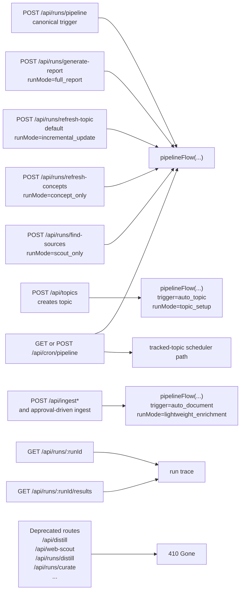
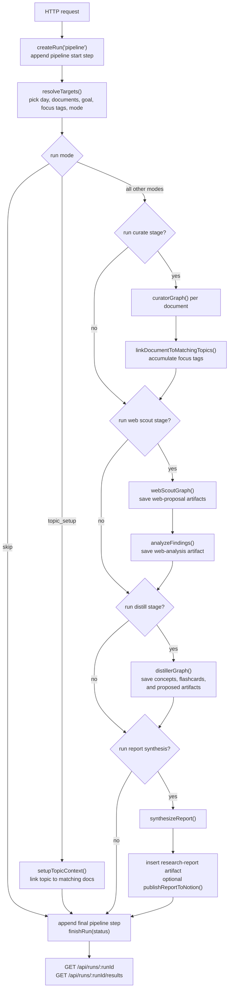
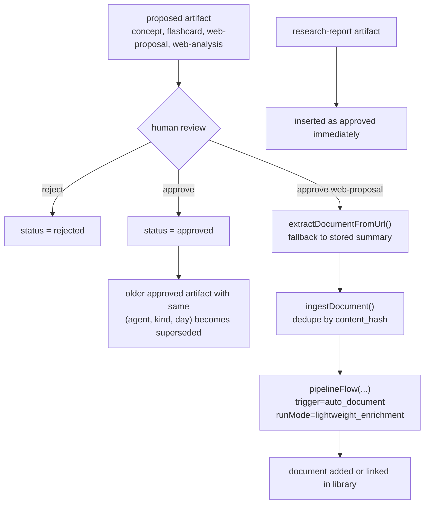
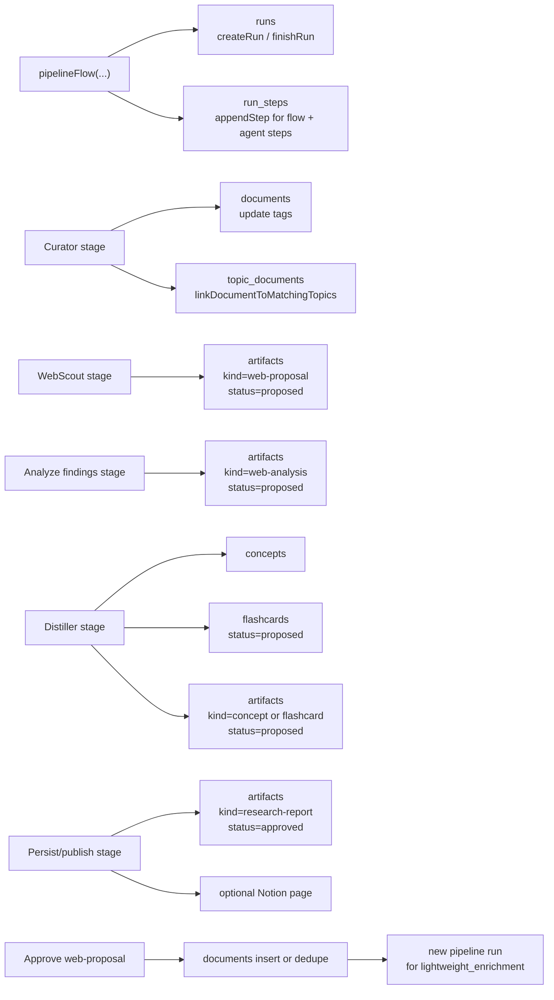

# Current Agent Architecture

This document describes the architecture that is implemented today.
The behavioral source of truth is `server/flows/pipeline.flow.ts`.

## At a glance

- Canonical trigger path: `POST /api/runs/pipeline`
- Wrapper routes and cron routes are thin entrypoints into the same `pipelineFlow(...)`
- Legacy single-agent trigger routes remain as compatibility stubs and return `410`
- Curator updates documents and tags, WebScout proposes sources, Distiller proposes concepts and flashcards
- Research reports are stored as approved `research-report` artifacts

## Canonical entrypoints and routing

Current-state notes:

- `POST /api/runs/pipeline` is the canonical write path for manual runs.
- The wrapper routes only prefill `PipelineInput` and `runMode`; they do not implement separate agent-specific orchestration.
- `POST /api/topics` triggers a `topic_setup` pipeline run after topic creation.
- Ingestion and approved web proposals can trigger `lightweight_enrichment`.
- Legacy routes such as `/api/distill`, `/api/web-scout`, `/api/runs/distill`, and `/api/runs/curate` are deprecated and return `410`.

## Pipeline end-to-end workflow

Mode-to-stage summary:

| `runMode` | Stages included |
| --- | --- |
| `full_report` | resolve, curate, webScout, analyze, distill, synthesize, persist/publish |
| `incremental_update` | resolve, curate, webScout, analyze, distill, synthesize, persist/publish |
| `concept_only` | resolve, curate, distill |
| `scout_only` | resolve, curate, webScout, analyze |
| `lightweight_enrichment` | resolve, curate, and optionally distill when `enableAutoDistill=true` |
| `topic_setup` | resolve, topic setup |
| `skip` | resolve, finish |

Current-state notes:

- `resolveTargets()` can derive the goal from explicit input, topic config, document tags, top vault tags, document titles, or a default fallback.
- WebScout stops at proposals. Analysis and report synthesis happen in the pipeline layer after `webScoutGraph()` returns.
- Distillation and report synthesis are skipped based on `runMode`, not because they have separate public trigger paths.
- The pipeline owns the final `PipelineResult`, terminal run status, and the run-level artifact/report aggregation.

## Agent internals

```mermaid
flowchart TD
  subgraph Curator["Curator graph"]
    C1["loadDocument"] --> C2["extractTags<br/>LLM structured output<br/>12,000 char cap"]
    C2 --> C3["categorize<br/>optional LLM"]
    C3 --> C4["findRelated<br/>deterministic tag overlap"]
    C4 --> C5["persistTags<br/>update documents.tags"]
  end

  subgraph WebScout["WebScout graph"]
    W1["setup<br/>vault context + due watchlist"] --> W2["agent<br/>OpenAI Responses API<br/>tool round"]
    W2 --> W3{"tool calls present<br/>and limits not hit?"}
    W3 -->|"yes"| W4["executeTools<br/>searchWeb<br/>checkVaultDuplicate<br/>evaluateResult<br/>refineQuery"]
    W4 --> W2
    W3 -->|"no"| W5["finalize<br/>dedupe quality results<br/>save web-proposal artifacts"]
  end

  subgraph Distiller["Distiller graph"]
    D1["fetchDocuments"] --> D2["extractConcepts<br/>LLM structured output<br/>4,000 char cap per doc"]
    D2 --> D3["saveConcepts<br/>insert concepts + concept artifacts"]
    D3 --> D4["generateFlashcards<br/>LLM structured output"]
    D4 --> D5["saveFlashcards<br/>insert flashcards + flashcard artifacts"]
    D5 --> D6{"more docs?"}
    D6 -->|"yes"| D2
    D6 -->|"no"| D7["done"]
  end
```

Current-state notes:

- Curator is deterministic orchestration around LLM extraction. It mutates `documents.tags` but does not create artifacts.
- WebScout is implemented as a ReAct-style loop using the OpenAI Responses API plus server-side tool execution.
- WebScout proposals store reasoning traces, but the graph itself does not synthesize reports or import URLs.
- Distiller writes both domain rows (`concepts`, `flashcards`) and review artifacts (`concept`, `flashcard`) in the same pass.

## Artifact lifecycle and human review loop

Current-state notes:

- Approval endpoints exist and are used by the review queue.
- Approving a concept or flashcard only changes artifact lifecycle state.
- Approving a `web-proposal` can fetch the source, ingest it into `documents`, and trigger `lightweight_enrichment`.
- The approval-driven enrichment path currently curates the new document and may distill only if that path is explicitly configured with `enableAutoDistill=true`.
- Research reports are the exception to the proposal-first review loop: they are inserted as approved `research-report` artifacts when the pipeline persists a synthesized report.

## Persistence and observability

Current-state notes:

- `runs` and `run_steps` are the primary observability path for current execution.
- `llm_calls` exists in schema, but current operational tracing is still centered on `runs` and `run_steps`.
- `GET /api/runs/:runId` returns the raw timeline.
- `GET /api/runs/:runId/results` resolves that timeline into user-facing outputs: report, concepts, sources, flashcards, counts, and error messages.
- Artifact kinds currently used by the architecture include `concept`, `flashcard`, `web-proposal`, `web-analysis`, and `research-report`.
